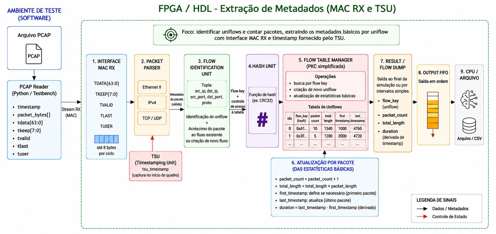

<p align="center">
  
</p>

<h1 align="center">
  Arquitetura em FPGA para Extração de Features de Fluxos TCP/IP
</h1>

Projeto acadêmico desenvolvido no **CI Digital Inatel – T25S2 – Grupo 2**, com foco no desenvolvimento, em HDL, de uma arquitetura para **extração de metadados e features de fluxos TCP/IP em FPGA**, visando aplicações em Sistemas de Detecção de Intrusão em Rede (NIDS) baseados em Machine Learning.

> **Importante:** o classificador de Machine Learning não faz parte do escopo deste projeto. O foco está na cadeia de hardware responsável por transformar o tráfego de rede em metadados e features estruturadas.

O repositório reúne a proposta do projeto, as pesquisas realizadas, as especificações técnicas dos módulos, a implementação em RTL, os scripts auxiliares em Python e os ambientes de verificação.

---

## Sumário

1. [Objetivo](#objetivo)
2. [Arquitetura do sistema](#arquitetura-do-sistema)
3. [Organização do repositório](#organização-do-repositório)
4. [Documentação técnica](#documentação-técnica)
5. [Implementação](#implementação)
6. [Extração de Metadados](#extração-de-metadados)
7. [Extração de Features](#extração-de-features)
8. [Estratégia de Verificação](#estratégia-de-verificação)
9. [Status do Desenvolvimento](#status-do-desenvolvimento)
10. [Roadmap](#roadmap)
11. [Equipe](#equipe)
12. [Resultado Esperado](#resultado-esperado)
13. [Referências iniciais](#referências-iniciais)
14. [Licença](#licença)

---

## Objetivo

Desenvolver em HDL um sistema capaz de:

* receber pacotes;
* interpretar os cabeçalhos e extrair metadados;
* identificar os fluxos de comunicação;
* armazenar o estado dos fluxos;
* atualizar as estatísticas com a chegada de novos pacotes;
* gerar o vetor de features para utilização posterior por um modelo de Machine Learning.

---

## Arquitetura do sistema

A arquitetura é organizada em dois blocos principais:

* **Extração de Metadados**
* **Extração de Features**

O fluxo de processamento parte de arquivos PCAP no ambiente de teste, passa pela interface MAC RX e pelo Packet Parser, segue para identificação do uniflow e cálculo do hash, e então alimenta a estrutura responsável por manter e atualizar o estado dos fluxos.

Durante a fase atual de simulação, o timestamp é obtido a partir do próprio arquivo PCAP. Na futura implementação em FPGA, essa informação será fornecida por um módulo TSU.

<p align="center">
  
</p>

---

## Organização do repositório

| Diretório | Descrição |
|---|---|
| [`Proposta/`](./Proposta/) | Documentos da proposta inicial do projeto |
| [`Pesquisas/`](./Pesquisas/) | Pesquisas realizadas sobre arquitetura, bibliografia e features |
| [`Especificação/`](./Especificação/) | Documentação técnica e especificações dos módulos |
| [`docs/`](./docs/) | Imagens e diagramas utilizados na documentação (`docs/images/`) |
| [`python/`](./python/) | Scripts auxiliares e implementações em Python |
| [`rtl/`](./rtl/) | Implementação dos módulos em RTL |
| [`tb/`](./tb/) | Testbenches e arquivos de verificação |

Estrutura geral:

```text
.
├── Especificação/
│   ├── Extracao de Features/
│   ├── Extracao de Metadados/
│   └── Verificacao/
├── Pesquisas/
│   ├── Arquitetura/
│   ├── Bibliografia/
│   └── Features/
├── Proposta/
├── docs/
│   └── images/
├── python/
├── rtl/
├── tb/
├── .gitignore
├── LICENSE
└── README.md
```

---

## Documentação técnica

As especificações estão organizadas por área de desenvolvimento.

| Área | Documentação |
|---|---|
| Extração de Metadados | [Acessar documentação](./Especificação/Extracao%20de%20Metadados/) |
| Extração de Features | [Acessar documentação](./Especificação/Extracao%20de%20Features/) |
| Verificação | [Acessar documentação](./Especificação/Verificacao/) |

Cada área contém os documentos técnicos relacionados aos seus respectivos módulos.

As pesquisas que embasaram as decisões de projeto estão organizadas em `Pesquisas/`:

| Tema | Conteúdo |
|---|---|
| [Arquitetura](./Pesquisas/Arquitetura/) | Pesquisa de arquiteturas e estratégias de implementação em hardware |
| [Bibliografia](./Pesquisas/Bibliografia/) | Artigos e referências utilizados no projeto |
| [Features](./Pesquisas/Features/) | Estudo das features de fluxo consideradas |

---

## Implementação

O código-fonte está organizado de acordo com sua finalidade:

* **RTL:** implementação dos módulos de hardware.
* **Python:** scripts auxiliares e ferramentas de apoio, como a conversão de arquivos PCAP em estímulos.
* **Testbenches:** simulação e validação dos módulos.

---

# Extração de Metadados

O bloco de **Extração de Metadados** tem como função transformar os pacotes recebidos pela interface de entrada em informações que permitam:

* identificar o fluxo ao qual cada pacote pertence;
* determinar o índice de consulta de cada fluxo na Flow Table;
* disponibilizar os metadados necessários para o processamento das features de cada fluxo.

A arquitetura deste bloco é organizada em três módulos:

* **Packet Parser**
* **Flow Identification Unit**
* **Hash Unit**

---

## Packet Parser

O **Packet Parser** é responsável por interpretar os pacotes TCP/IP recebidos pela interface de entrada e extrair as informações necessárias às etapas seguintes.

Os principais metadados produzidos são:

```text
src_ip
dst_ip
src_port
dst_port
protocol
packet_length
timestamp
```

---

## FSM do Packet Parser

A máquina de estados do Packet Parser controla a recepção do quadro, a interpretação dos cabeçalhos Ethernet II e IPv4, a seleção do protocolo TCP/UDP e a validação final do pacote.


---

### Interface MAC RX

O Packet Parser está sendo adaptado para operar com uma interface compatível com o MAC RX de referência.

Os principais sinais de entrada são:

| Sinal    | Largura | Função                                       |
| -------- | ------: | -------------------------------------------- |
| `TDATA`  | 64 bits | Transporta os dados do quadro Ethernet       |
| `TKEEP`  |  8 bits | Indica quais bytes de `TDATA` são válidos    |
| `TVALID` |   1 bit | Indica que os dados apresentados são válidos |
| `TLAST`  |   1 bit | Indica a última transferência do quadro      |
| `TUSER`  |   1 bit | Indica a validade final do quadro recebido   |

O início de um novo quadro é identificado quando o Parser está aguardando um novo pacote e ocorre:

```text
TVALID = 1
```

O final do quadro é identificado por:

```text
TVALID && TLAST
```

---

### Timestamp e TSU

O timestamp não será gerado internamente pelo Parser.

Um módulo separado denominado **TSU (Timestamping Unit)** será conectado ao Packet Parser e fornecerá a referência temporal utilizada para registrar o instante de chegada de cada pacote.

O Parser deverá capturar o timestamp no início da recepção de um novo quadro.

A interface definitiva do TSU ainda será especificada ao longo do desenvolvimento.

---

### Ethernet II

O Parser deverá interpretar o cabeçalho Ethernet II.

O principal campo utilizado nesta etapa é o `EtherType`.

Para a primeira PoC:

```text
EtherType = 0x0800 → IPv4
```

Outros valores de EtherType serão considerados fora do escopo inicial do Parser.

---

### IPv4

No cabeçalho IPv4, os principais campos utilizados serão:

```text
Version
IHL
Total Length
Protocol
Source IP
Destination IP
```

Os critérios iniciais são:

```text
Version = 4
IHL >= 5
```

---

### IHL e localização da camada de transporte

O campo `IHL` indica o tamanho do cabeçalho IPv4 em palavras de 32 bits.

Assim:

```text
IPv4 header size = IHL × 4 bytes
```

O início do cabeçalho TCP ou UDP será calculado dinamicamente por:

```text
transport_offset = 14 + (IHL × 4)
```

onde:

```text
14 bytes = cabeçalho Ethernet II
```

Exemplo:

```text
IHL = 5

IPv4 header = 5 × 4 = 20 bytes

transport_offset = 14 + 20
transport_offset = 34 bytes
```

Se `IHL > 5`, significa que existem opções IPv4.

Nesta primeira versão, essas opções:

* não serão interpretadas;
* não serão utilizadas como features;
* serão apenas ignoradas até que o Parser alcance o início do cabeçalho TCP ou UDP.

---

### Protocolos de transporte

O campo `Protocol` do IPv4 será utilizado para selecionar o protocolo da camada de transporte.

```text
Protocol = 6   → TCP
Protocol = 17  → UDP
outro valor    → protocolo não suportado
```

---

### TCP

Para pacotes TCP, inicialmente serão extraídos:

```text
src_port
dst_port
```

As flags TCP poderão futuramente ser incorporadas como metadados adicionais caso sejam selecionadas como features do sistema.

---

### UDP

Para pacotes UDP, inicialmente serão extraídos:

```text
src_port
dst_port
```

---

## Flow Identification Unit

A **Flow Identification Unit** é responsável por gerar a chave utilizada para identificar o fluxo ao qual cada pacote pertence.

A identificação será baseada na 5-tuple:

```text
flow_key = {
    src_ip,
    dst_ip,
    src_port,
    dst_port,
    protocol
}
```

A largura total da chave será:

```text
src_ip      = 32 bits
dst_ip      = 32 bits
src_port    = 16 bits
dst_port    = 16 bits
protocol    =  8 bits
----------------------
flow_key    = 104 bits
```

Nesta primeira versão, serão considerados **fluxos unidirecionais**.

Portanto:

```text
A → B
```

e

```text
B → A
```

são considerados fluxos distintos.

---

## Hash Unit

A **Hash Unit** recebe a `flow_key` e gera o índice utilizado para consultar a Flow Table.

```text
hash_index = hash(flow_key)
```

As alternativas inicialmente consideradas foram:

* CRC-16
* CRC-32

A função final foi selecionada considerando:

* sintetizabilidade;
* custo em hardware;
* distribuição dos índices;
* largura da Flow Table;
* utilização de recursos da FPGA.

### Decisão: CRC-16

Foi selecionado o **CRC-16** como padrão para a arquitetura atual.

A decisão considera a capacidade de endereçamento necessária e o custo de memória associado a cada alternativa.

| Parâmetro                   | Definição |
| --------------------------- | --------- |
| Função hash                 | CRC-16    |
| Índice gerado               | 16 bits   |
| Quantidade de entradas      | 65.536    |
| Largura física da memória   | 16 bits   |
| Palavras por entrada        | 32        |
| Largura lógica por entrada  | 512 bits  |
| Capacidade total aproximada | 4 MB      |

A alternativa CRC-32 foi descartada para a arquitetura atual, pois exigiria uma estrutura com aproximadamente 4 bilhões de entradas, resultando em uma demanda de memória estimada em cerca de 14 GB, inviável para o contexto de implementação considerado.

A seleção do CRC-16 estabelece a capacidade de endereçamento da tabela. Ela não elimina a possibilidade de colisões entre fluxos diferentes, que continuam sendo verificadas por meio da comparação da `flow_key`.

---

# Extração de Features

O bloco de **Extração de Features** é responsável por gerenciar os fluxos ativos em uma tabela, manter e atualizar as informações de estado e gerar os vetores de features por fluxo disponibilizados na saída do sistema.

A arquitetura inicialmente proposta possui quatro componentes:

* **Controller**
* **Flow Table**
* **Feature Update Unit**
* **Flow Finalizer**

A organização interna desses módulos poderá ser ajustada ao longo do desenvolvimento.

---

## Controller

O **Controller** coordena o funcionamento do bloco de Extração de Features.

Entre suas responsabilidades estão:

* receber os metadados de cada pacote;
* gerenciar o estado dos fluxos;
* consultar a Flow Table;
* processar os resultados da consulta;
* coordenar a atualização dos fluxos;
* coordenar a finalização dos fluxos;
* controlar a sequência de operações de leitura e escrita da memória.

Os principais resultados de uma consulta à Flow Table são:

```text
HIT
MISS
COLLISION
```

### HIT

O fluxo já está armazenado na Flow Table.

```text
HIT
 ↓
Atualizar estado do fluxo
```

### MISS

O fluxo ainda não está armazenado.

```text
MISS
 ↓
Inicializar nova entrada
 ↓
Inserir fluxo na Flow Table
```

### COLLISION

O índice calculado já está ocupado por outro fluxo.

Na política inicial:

```text
COLLISION
 ↓
Novo fluxo não é inserido
 ↓
Ocorrência é sinalizada
```

### Sequenciamento das operações da Flow Table

O Controller coordena o acesso à memória física da Flow Table. Ele gerencia a sequência de leituras e escritas necessária para consultar uma entrada, identificar o resultado da busca e executar a operação correspondente.

O fluxo de controle previsto é:

```text
Receber metadados do pacote
          ↓
Calcular/receber hash_index
          ↓
Consultar a Flow Table
          ↓
Verificar a entrada
          ↓
 ┌────────┼──────────┐
 ↓        ↓          ↓
 HIT      MISS       COLLISION
 ↓        ↓          ↓
Ler e   Inicializar  Sinalizar
atualizar nova       ocorrência
estado   entrada     sem escrita
 ↓        ↓
Escrever Escrever
atualizações entrada
```

O sequenciamento de acesso à memória deverá respeitar a latência e a organização física da Flow Table.

A especificação do Controller contempla as regras de consulta, inicialização, atualização e tratamento de colisões. A implementação da máquina de estados e sua integração com a memória permanecem como etapas de desenvolvimento.

---

## Pesquisa e especificação da implementação em hardware

Esta frente contempla a pesquisa de arquiteturas e estratégias para implementar em FPGA o armazenamento e o processamento de fluxos de rede.

A pesquisa considera aspectos como:

* organização e dimensionamento da memória;
* armazenamento dos metadados e das estatísticas de cada fluxo;
* gerenciamento de leituras e escritas na Flow Table;
* identificação de fluxos existentes e tratamento de colisões;
* atualização incremental das estatísticas;
* integração entre Controller, Flow Table, Feature Update Unit e Flow Finalizer;
* viabilidade da arquitetura considerando os recursos disponíveis na FPGA.

A partir dessa análise, foi definida uma organização inicial para a Flow Table e para o acesso à memória, que servirá como referência para a implementação em HDL.

---

## Flow Table

A **Flow Table** é responsável por armazenar o estado dos fluxos monitorados. Cada entrada mantém a identificação do fluxo e as estatísticas necessárias para a atualização e a geração posterior do vetor de features.

### Organização da memória

A estrutura foi especificada considerando uma memória física de 16 bits, organizada em 32 palavras por entrada.

| Parâmetro                   | Valor    |
| --------------------------- | -------- |
| Quantidade de entradas      | 65.536   |
| Largura física              | 16 bits  |
| Palavras por entrada        | 32       |
| Largura lógica por entrada  | 512 bits |
| Capacidade total aproximada | 4 MB     |

A organização em palavras permite que uma entrada lógica seja acessada por meio de múltiplas operações de leitura e escrita na memória física.

A definição dos campos e de suas posições na entrada lógica deverá ser mantida consistente entre a Flow Table, o Controller e os módulos responsáveis pela atualização e finalização dos fluxos.

### Campos armazenados

Os campos previstos para o estado de cada fluxo incluem:

```text
valid
flow_key
packet_count
byte_count
first_timestamp
last_timestamp
```

Exemplo conceitual:

| Campo             | Função                                     |
| ----------------- | ------------------------------------------ |
| `valid`           | Indica se a entrada contém um fluxo válido |
| `flow_key`        | Identificador do fluxo                     |
| `packet_count`    | Quantidade de pacotes recebidos            |
| `byte_count`      | Quantidade acumulada de bytes              |
| `first_timestamp` | Timestamp do primeiro pacote               |
| `last_timestamp`  | Timestamp do pacote mais recente           |

A estrutura também reserva espaço para acomodar os campos e controles definidos na especificação da entrada lógica.

### Consulta e atualização

A consulta à Flow Table utiliza o índice produzido pela Hash Unit. Após acessar a entrada correspondente, o sistema verifica o estado da entrada e compara a chave armazenada com a chave do pacote recebido.

Os resultados possíveis são:

* **HIT:** a entrada contém o fluxo procurado;
* **MISS:** a entrada está disponível para receber um novo fluxo;
* **COLLISION:** a entrada está ocupada por outro fluxo.

A comparação da `flow_key` é necessária para distinguir um fluxo já armazenado de outro fluxo que produziu o mesmo índice hash.

### Política inicial de tratamento

| Resultado   | Comportamento                                                           |
| ----------- | ----------------------------------------------------------------------- |
| `HIT`       | Atualizar as estatísticas do fluxo existente                            |
| `MISS`      | Inicializar e inserir uma nova entrada                                  |
| `COLLISION` | Sinalizar a ocorrência e descartar o pacote, sem sobrescrever a entrada |

A política inicial não prevê substituição de entradas ocupadas em caso de colisão.

### Sequenciamento de acesso à memória

O Controller é responsável por coordenar as operações de leitura e escrita necessárias para consultar e atualizar as entradas.

A especificação inicial considera os seguintes padrões de acesso:

| Operação                               | Leituras | Escritas |
| -------------------------------------- | -------: | -------: |
| Consulta                               |        8 |        0 |
| Inicialização de nova entrada (`MISS`) |        8 |       24 |
| Atualização de fluxo existente (`HIT`) |       24 |       24 |
| Colisão (`COLLISION`)                  |        8 |        0 |

Esses valores representam o sequenciamento previsto para a organização atual da memória. O comportamento deverá ser confirmado durante a implementação e a verificação do sistema.

---

## Atualização do estado do fluxo

Quando um pacote pertencente a um fluxo já existente é recebido, as estatísticas são atualizadas.

Inicialmente:

```text
packet_count = packet_count + 1
```

```text
byte_count = byte_count + packet_length
```

```text
last_timestamp = timestamp
```

---

## Flow Finalizer

O **Flow Finalizer** é responsável por gerar o vetor de features a partir do estado acumulado de cada fluxo.

Na primeira PoC, uma das features temporais será:

```text
duration = last_timestamp - first_timestamp
```

O vetor inicial de features será composto por:

```text
packet_count
byte_count
duration
```

A `flow_key` permanecerá associada ao fluxo para identificação.

---

# Estratégia de Verificação

A verificação será realizada em três níveis:

* módulo;
* subsistema;
* sistema completo.

Serão utilizados:

* dados sintéticos;
* arquivos PCAP;
* modelo de referência em software;
* comparação dos resultados;
* implementação posterior em FPGA.

Fluxo de verificação previsto:

```text
Arquivo PCAP
     ↓
Conversor Python
     ↓
Arquivo de estímulos
     ↓
Testbench
     ↓
DUT
     ↓
Comparação com modelo de referência
```

O script Python será responsável por converter os pacotes em estímulos compatíveis com a interface do MAC RX.

Os principais sinais serão:

```text
TDATA
TKEEP
TVALID
TLAST
TUSER
```

O testbench deverá reproduzir o comportamento da interface de recepção do MAC.

Para o timestamp, poderá ser utilizado inicialmente um modelo de TSU no ambiente de simulação.

---

# Status do Desenvolvimento

Os itens marcados indicam atividades de pesquisa, definição ou documentação já realizadas. A marcação não significa necessariamente que o módulo correspondente já esteja implementado ou validado em HDL.

## Extração de Metadados

* [x] Mapeamento inicial de Ethernet II
* [x] Mapeamento inicial de IPv4
* [x] Mapeamento inicial de TCP
* [x] Mapeamento inicial de UDP
* [x] Definição dos principais campos de interesse
* [x] Definição da 5-tuple
* [x] Primeira versão da FSM do Packet Parser
* [ ] Parser funcional em simulação com pacote TCP controlado
* [ ] Extração de EtherType
* [ ] Extração de Version
* [ ] Extração de IHL
* [ ] Extração de Protocol
* [ ] Extração de Source IP
* [ ] Extração de Destination IP
* [ ] Extração de Source Port
* [ ] Extração de Destination Port
* [ ] Leitura automática de arquivo de estímulos
* [ ] Adaptação completa do Packet Parser para a interface MAC RX
* [ ] Integração com TSU
* [ ] Validação de pacote UDP
* [ ] Validação de IHL variável
* [ ] Integração com Flow Identification Unit
* [ ] Implementação da Hash Unit
* [ ] Integração completa do bloco de Extração de Metadados

## Extração de Features

* [x] Pesquisa inicial de arquiteturas para extração de features em hardware
* [x] Definição da arquitetura inicial da Flow Table
* [x] Definição da organização da memória física e lógica
* [x] Dimensionamento inicial da Flow Table
* [x] Avaliação das alternativas CRC-16 e CRC-32
* [x] Seleção do CRC-16 como padrão da arquitetura
* [x] Especificação inicial dos campos armazenados por fluxo
* [x] Definição das regras de HIT, MISS e COLLISION
* [x] Especificação inicial do sequenciamento de acesso à memória
* [x] Documentação da arquitetura e das responsabilidades do Controller
* [ ] Implementação da Flow Table em HDL
* [ ] Implementação do Controller
* [ ] Implementação do tratamento de HIT
* [ ] Implementação do tratamento de MISS
* [ ] Implementação do tratamento de COLLISION
* [ ] Atualização de `packet_count`
* [ ] Atualização de `byte_count`
* [ ] Registro de `first_timestamp`
* [ ] Registro de `last_timestamp`
* [ ] Cálculo de `duration`
* [ ] Implementação do Flow Finalizer
* [ ] Integração entre Flow Table, Controller, Feature Update Unit e Flow Finalizer
* [ ] Validação da geração do vetor de features

## Verificação e Interfaces

* [ ] Definição inicial da estratégia de verificação
* [ ] Definição inicial da interface MAC RX de referência
* [ ] Primeira geração de arquivo de estímulos
* [ ] Primeiro testbench do Packet Parser
* [ ] Atualização do conversor Python para a interface MAC RX
* [ ] Testbench compatível com `TDATA`
* [ ] Testbench compatível com `TKEEP`
* [ ] Testbench compatível com `TVALID`
* [ ] Testbench compatível com `TLAST`
* [ ] Testbench compatível com `TUSER`
* [ ] Modelo de referência completo
* [ ] Testes com múltiplos pacotes
* [ ] Testes com múltiplos fluxos
* [ ] Testes end-to-end

---

# Roadmap

As próximas etapas previstas incluem:

1. adaptar o Packet Parser para a interface MAC RX;
2. implementar o comportamento do TSU no ambiente de simulação;
3. validar a captura do timestamp no início do quadro;
4. validar pacotes TCP;
5. validar pacotes UDP;
6. validar o cálculo dinâmico de `transport_offset`;
7. integrar a Flow Identification Unit;
8. implementar a função hash CRC-16;
9. integrar o bloco completo de Extração de Metadados;
10. implementar a Flow Table em HDL conforme a especificação de memória;
11. desenvolver a máquina de estados do Controller;
12. implementar e validar as operações de consulta, inicialização e atualização;
13. desenvolver a atualização das features;
14. desenvolver o Flow Finalizer;
15. executar testes com múltiplos fluxos;
16. validar os resultados utilizando arquivos PCAP;
17. comparar os resultados com o modelo de referência;
18. realizar a integração completa do sistema;
19. avaliar a implementação em FPGA.

---

# Equipe

A equipe está dividida em três frentes principais:

* Extração de Metadados
* Extração de Features
* Verificação e Interfaces

| Membro                              | Frente                   | Função / Responsabilidade                                                                                                                                                    |
| ----------------------------------- | ------------------------ | ---------------------------------------------------------------------------------------------------------------------------------------------------------------------------- |
| **Alessandra Carolina Domiciano**   | Extração de Features     | Controller, gerenciamento dos fluxos e integração com a Flow Table                                                                                                           |
| **Beatriz Bastos Assis**            | Verificação e Interfaces | Conversão de pacotes em estímulos, interfaces e ambiente de verificação                                                                                                      |
| **Bruno Augusto Caetano Coura**     | Extração de Metadados    | Packet Parser, Flow Identification Unit e integração do bloco de metadados                                                                                                   |
| **Daniela Maria Barbosa Faria**     | Verificação e Interfaces | Modelo de referência, testbenches parciais e end-to-end e interfaces de entrada e saída                                                                                      |
| **Elaine Cristina de Cássia Silva** | Extração de Features     | Pesquisa de implementação em hardware, especificação e dimensionamento da Flow Table, organização da memória e definição das operações de acesso coordenadas pelo Controller |
| **Fábio Henrique Moreira**          | Extração de Features     | Atualização das features e Flow Finalizer                                                                                                                                    |
| **Herman Cristiano Jaime**          | Extração de Metadados    | Mapeamento dos protocolos, Packet Parser, FSM, integração MAC/TSU e apoio à Flow Identification                                                                              |
| **Samuel Josias Ross**              | Extração de Metadados    | Hash Unit, avaliação das funções hash e integração com a Flow Identification Unit                                                                                            |

---

# Resultado Esperado

Ao final do projeto, espera-se obter uma arquitetura capaz de:

* processar tráfego TCP/IP em streaming;
* identificar e manter o estado de fluxos unidirecionais;
* extrair `packet_count`, `byte_count` e `duration`;
* gerar um vetor de features por fluxo;
* validar os resultados utilizando arquivos PCAP e modelo de referência;
* avaliar a viabilidade da extração de features em FPGA.

---

### Orientação

* Dr. Elivander Pereira
* MsC. Felipe Rocha
* Dra. Letícia Carneiro

### Instituição

**Instituto Nacional de Telecomunicações – Inatel**

Santa Rita do Sapucaí – MG
2026

---

# Referências iniciais

* Umer et al. *Flow-Based Intrusion Detection: Techniques and Challenges*. Computers & Security, 2017.
* Sha et al. *A High-Performance and Accurate FPGA-Based Flow Monitor for 100 Gbps Networks*. Electronics, 2022.
* Kekely et al. *Low-Latency Modular Packet Header Parser for FPGA*. ANCS, 2012.
* Tong; Prasanna. *Dynamically Configurable Online Statistical Flow Feature Extractor on FPGA*. HPEC, 2013.

---

# Licença

Este projeto utiliza a licença **Apache License 2.0**.
