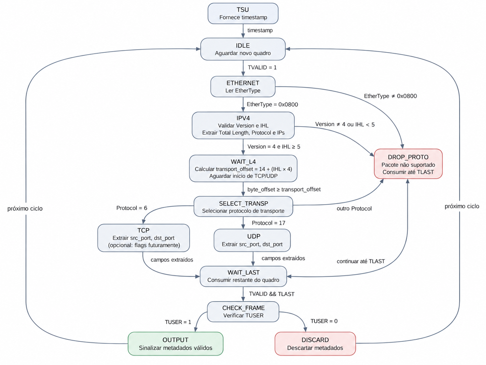

# Arquitetura em FPGA para Extração de Features de Fluxos TCP/IP

Projeto acadêmico desenvolvido no **CI Digital Inatel – T25S2 – Grupo 2**, com foco no desenvolvimento, em HDL, de uma arquitetura para **extração de metadados e features de fluxos TCP/IP em FPGA**, visando aplicações em Sistemas de Detecção de Intrusão em Rede (NIDS) baseados em Machine Learning.

> **Importante:** o classificador de Machine Learning não faz parte do escopo deste projeto. O foco está na cadeia de hardware responsável por transformar o tráfego de rede em metadados e features estruturadas.

---

## Objetivo

Desenvolver em HDL um sistema capaz de:

- receber pacotes;
- interpretar os cabeçalhos e extrair metadados;
- identificar os fluxos de comunicação;
- armazenar o estado dos fluxos;
- atualizar as estatísticas com a chegada de novos pacotes;
- gerar o vetor de features para utilização posterior por um modelo de Machine Learning.

---

## Escopo inicial

A primeira prova de conceito considera os seguintes elementos:

### Protocolos

- Ethernet II
- IPv4
- TCP
- UDP

### Modelo de fluxo

- Fluxos unidirecionais (**uniflows**)

### Features iniciais

- `packet_count`
- `byte_count`
- `duration`

---

## Arquitetura do sistema

A arquitetura é organizada em dois blocos principais:


---

# Extração de Metadados

O bloco de **Extração de Metadados** tem como função transformar os pacotes recebidos pela interface de entrada em informações que permitam:

- identificar o fluxo ao qual cada pacote pertence;
- determinar o índice de consulta de cada fluxo na Flow Table;
- disponibilizar os metadados necessários para o processamento das features de cada fluxo.

A arquitetura deste bloco é organizada em três módulos:

- **Packet Parser**
- **Flow Identification Unit**
- **Hash Unit**

---

## Packet Parser

O **Packet Parser** é responsável por interpretar os pacotes TCP/IP recebidos pela interface de entrada e extrair as informações necessárias às etapas seguintes.

Os principais metadados produzidos são:

```text
src_ip
dst_ip
src_port
dst_port
protocol
packet_length
timestamp
```

---
## FSM do Packet Parser

A máquina de estados do Packet Parser controla a recepção do quadro, a interpretação dos cabeçalhos Ethernet II e IPv4, a seleção do protocolo TCP/UDP e a validação final do pacote.


----

### Interface MAC RX

O Packet Parser está sendo adaptado para operar com uma interface compatível com o MAC RX de referência.


Os principais sinais de entrada são:

| Sinal | Largura | Função |
|---|---:|---|
| `TDATA` | 64 bits | Transporta os dados do quadro Ethernet |
| `TKEEP` | 8 bits | Indica quais bytes de `TDATA` são válidos |
| `TVALID` | 1 bit | Indica que os dados apresentados são válidos |
| `TLAST` | 1 bit | Indica a última transferência do quadro |
| `TUSER` | 1 bit | Indica a validade final do quadro recebido |

O início de um novo quadro é identificado quando o Parser está aguardando um novo pacote e ocorre:

```text
TVALID = 1
```

O final do quadro é identificado por:

```text
TVALID && TLAST
```

---

### Timestamp e TSU

O timestamp não será gerado internamente pelo Parser.

Um módulo separado denominado **TSU (Timestamping Unit)** será conectado ao Packet Parser e fornecerá a referência temporal utilizada para registrar o instante de chegada de cada pacote.

O Parser deverá capturar o timestamp no início da recepção de um novo quadro.

A interface definitiva do TSU ainda será especificada ao longo do desenvolvimento.

---

### Ethernet II

O Parser deverá interpretar o cabeçalho Ethernet II.

O principal campo utilizado nesta etapa é o `EtherType`.

Para a primeira PoC:

```text
EtherType = 0x0800 → IPv4
```

Outros valores de EtherType serão considerados fora do escopo inicial do Parser.

---

### IPv4

No cabeçalho IPv4, os principais campos utilizados serão:

```text
Version
IHL
Total Length
Protocol
Source IP
Destination IP
```

Os critérios iniciais são:

```text
Version = 4
IHL >= 5
```

---

### IHL e localização da camada de transporte

O campo `IHL` indica o tamanho do cabeçalho IPv4 em palavras de 32 bits.

Assim:

```text
IPv4 header size = IHL × 4 bytes
```

O início do cabeçalho TCP ou UDP será calculado dinamicamente por:

```text
transport_offset = 14 + (IHL × 4)
```

onde:

```text
14 bytes = cabeçalho Ethernet II
```

Exemplo:

```text
IHL = 5

IPv4 header = 5 × 4 = 20 bytes

transport_offset = 14 + 20
transport_offset = 34 bytes
```

Se `IHL > 5`, significa que existem opções IPv4.

Nesta primeira versão, essas opções:

- não serão interpretadas;
- não serão utilizadas como features;
- serão apenas ignoradas até que o Parser alcance o início do cabeçalho TCP ou UDP.

---

### Protocolos de transporte

O campo `Protocol` do IPv4 será utilizado para selecionar o protocolo da camada de transporte.

```text
Protocol = 6   → TCP
Protocol = 17  → UDP
outro valor    → protocolo não suportado
```

---

### TCP

Para pacotes TCP, inicialmente serão extraídos:

```text
src_port
dst_port
```

As flags TCP poderão futuramente ser incorporadas como metadados adicionais caso sejam selecionadas como features do sistema.

---

### UDP

Para pacotes UDP, inicialmente serão extraídos:

```text
src_port
dst_port
```

---

## Flow Identification Unit

A **Flow Identification Unit** é responsável por gerar a chave utilizada para identificar o fluxo ao qual cada pacote pertence.

A identificação será baseada na 5-tuple:

```text
flow_key = {
    src_ip,
    dst_ip,
    src_port,
    dst_port,
    protocol
}
```

A largura total da chave será:

```text
src_ip      = 32 bits
dst_ip      = 32 bits
src_port    = 16 bits
dst_port    = 16 bits
protocol    =  8 bits
----------------------
flow_key    = 104 bits
```

Nesta primeira versão, serão considerados **fluxos unidirecionais**.

Portanto:

```text
A → B
```

e

```text
B → A
```

são considerados fluxos distintos.

---

## Hash Unit

A **Hash Unit** recebe a `flow_key` e gera o índice utilizado para consultar a Flow Table.

```text
hash_index = hash(flow_key)
```

As alternativas atualmente consideradas incluem:

- CRC-16
- CRC-32

A função final deverá ser selecionada considerando:

- sintetizabilidade;
- custo em hardware;
- distribuição dos índices;
- largura da Flow Table;
- utilização de recursos da FPGA.

---

# Extração de Features

O bloco de **Extração de Features** é responsável por gerenciar os fluxos ativos em uma tabela, manter e atualizar as informações de estado e gerar os vetores de features por fluxo disponibilizados na saída do sistema.

A arquitetura inicialmente proposta possui quatro componentes:

- **Controller**
- **Flow Table**
- **Feature Update Unit**
- **Flow Finalizer**

A organização interna desses módulos poderá ser ajustada ao longo do desenvolvimento.

---

## Controller

O **Controller** coordena o funcionamento do bloco de Extração de Features.

Entre suas responsabilidades estão:

- receber os metadados de cada pacote;
- gerenciar o estado dos fluxos;
- consultar a Flow Table;
- processar os resultados da consulta;
- coordenar a atualização dos fluxos;
- coordenar a finalização dos fluxos.

Os principais resultados de uma consulta à Flow Table são:

```text
HIT
MISS
COLLISION
```

### HIT

O fluxo já está armazenado na Flow Table.

```text
HIT
 ↓
Atualizar estado do fluxo
```

### MISS

O fluxo ainda não está armazenado.

```text
MISS
 ↓
Inicializar nova entrada
 ↓
Inserir fluxo na Flow Table
```

### COLLISION

O índice calculado já está ocupado por outro fluxo.

Na política inicial:

```text
COLLISION
 ↓
Novo fluxo não é inserido
 ↓
Ocorrência é sinalizada
```

---

## Flow Table

A **Flow Table** é responsável por armazenar o estado dos fluxos monitorados.

Os campos básicos previstos são:

```text
valid
flow_key
packet_count
byte_count
first_timestamp
last_timestamp
```

Exemplo conceitual:

| Campo | Função |
|---|---|
| `valid` | Indica se a entrada contém um fluxo válido |
| `flow_key` | Identificador do fluxo |
| `packet_count` | Quantidade de pacotes recebidos |
| `byte_count` | Quantidade acumulada de bytes |
| `first_timestamp` | Timestamp do primeiro pacote |
| `last_timestamp` | Timestamp do pacote mais recente |

---

## Atualização do estado do fluxo

Quando um pacote pertencente a um fluxo já existente é recebido, as estatísticas são atualizadas.

Inicialmente:

```text
packet_count = packet_count + 1
```

```text
byte_count = byte_count + packet_length
```

```text
last_timestamp = timestamp
```

---

## Flow Finalizer

O **Flow Finalizer** é responsável por gerar o vetor de features a partir do estado acumulado de cada fluxo.

Na primeira PoC, uma das features temporais será:

```text
duration = last_timestamp - first_timestamp
```

O vetor inicial de features será composto por:

```text
packet_count
byte_count
duration
```

A `flow_key` permanecerá associada ao fluxo para identificação.

---

# Estratégia de Verificação

A verificação será realizada em três níveis:

- módulo;
- subsistema;
- sistema completo.

Serão utilizados:

- dados sintéticos;
- arquivos PCAP;
- modelo de referência em software;
- comparação dos resultados;
- implementação posterior em FPGA.

Fluxo de verificação previsto:

```text
Arquivo PCAP
     ↓
Conversor Python
     ↓
Arquivo de estímulos
     ↓
Testbench
     ↓
DUT
     ↓
Comparação com modelo de referência
```

O script Python será responsável por converter os pacotes em estímulos compatíveis com a interface do MAC RX.

Os principais sinais serão:

```text
TDATA
TKEEP
TVALID
TLAST
TUSER
```

O testbench deverá reproduzir o comportamento da interface de recepção do MAC.

Para o timestamp, poderá ser utilizado inicialmente um modelo de TSU no ambiente de simulação.

---


---

# Status do Desenvolvimento

## Extração de Metadados

- [x] Mapeamento inicial de Ethernet II
- [x] Mapeamento inicial de IPv4
- [x] Mapeamento inicial de TCP
- [x] Mapeamento inicial de UDP
- [x] Definição dos principais campos de interesse
- [x] Definição da 5-tuple
- [x] Primeira versão da FSM do Packet Parser
- [ ] Parser funcional em simulação com pacote TCP controlado
- [ ] Extração de EtherType
- [ ] Extração de Version
- [ ] Extração de IHL
- [ ] Extração de Protocol
- [ ] Extração de Source IP
- [ ] Extração de Destination IP
- [ ] Extração de Source Port
- [ ] Extração de Destination Port
- [ ] Leitura automática de arquivo de estímulos
- [ ] Adaptação completa do Packet Parser para a interface MAC RX
- [ ] Integração com TSU
- [ ] Validação de pacote UDP
- [ ] Validação de IHL variável
- [ ] Integração com Flow Identification Unit
- [ ] Implementação da Hash Unit
- [ ] Integração completa do bloco de Extração de Metadados

---

## Extração de Features

- [ ] Definição final da Flow Table
- [ ] Implementação do Controller
- [ ] Tratamento de HIT
- [ ] Tratamento de MISS
- [ ] Tratamento de COLLISION
- [ ] Atualização de `packet_count`
- [ ] Atualização de `byte_count`
- [ ] Registro de `first_timestamp`
- [ ] Registro de `last_timestamp`
- [ ] Cálculo de `duration`
- [ ] Implementação do Flow Finalizer

---

## Verificação e Interfaces

- [ ] Definição inicial da estratégia de verificação
- [ ] Definição inicial da interface MAC RX de referência
- [ ] Primeira geração de arquivo de estímulos
- [ ] Primeiro testbench do Packet Parser
- [ ] Atualização do conversor Python para a interface MAC RX
- [ ] Testbench compatível com `TDATA`
- [ ] Testbench compatível com `TKEEP`
- [ ] Testbench compatível com `TVALID`
- [ ] Testbench compatível com `TLAST`
- [ ] Testbench compatível com `TUSER`
- [ ] Modelo de referência completo
- [ ] Testes com múltiplos pacotes
- [ ] Testes com múltiplos fluxos
- [ ] Testes end-to-end

---

# Roadmap

As próximas etapas previstas incluem:

1. adaptar o Packet Parser para a interface MAC RX;
2. implementar o comportamento do TSU no ambiente de simulação;
3. validar a captura do timestamp no início do quadro;
4. validar pacotes TCP;
5. validar pacotes UDP;
6. validar o cálculo dinâmico de `transport_offset`;
7. integrar a Flow Identification Unit;
8. selecionar e implementar a função hash;
9. integrar o bloco completo de Extração de Metadados;
10. desenvolver e integrar a Flow Table;
11. desenvolver o Controller;
12. implementar as atualizações das features;
13. desenvolver o Flow Finalizer;
14. executar testes com múltiplos fluxos;
15. validar os resultados utilizando arquivos PCAP;
16. comparar os resultados com o modelo de referência;
17. realizar a integração completa do sistema;
18. avaliar a implementação em FPGA.

---

# Equipe

A equipe está dividida em três frentes principais:

- Extração de Metadados
- Extração de Features
- Verificação e Interfaces

| Membro | Frente | Função / Responsabilidade |
|---|---|---|
| **Alessandra Carolina Domiciano** | Extração de Features | Controller, gerenciamento dos fluxos e integração com a Flow Table |
| **Beatriz Bastos Assis** | Verificação e Interfaces | Conversão de pacotes em estímulos, interfaces e ambiente de verificação |
| **Bruno Augusto Caetano Coura** | Extração de Metadados | Packet Parser, Flow Identification Unit e integração do bloco de metadados |
| **Daniela Maria Barbosa Faria** | Verificação e Interfaces | Modelo de referência, testbenches parciais e end-to-end e interfaces de entrada e saída |
| **Elaine Cristina de Cássia Silva** | Extração de Features | Flow Table e armazenamento do estado dos fluxos |
| **Fábio Henrique Moreira** | Extração de Features | Atualização das features e Flow Finalizer |
| **Herman Cristiano Jaime** | Extração de Metadados | Mapeamento dos protocolos, Packet Parser, FSM, integração MAC/TSU e apoio à Flow Identification |
| **Samuel Josias Ross** | Extração de Metadados | Hash Unit, avaliação das funções hash e integração com a Flow Identification Unit |

---

# Resultado Esperado

Ao final do projeto, espera-se obter uma arquitetura capaz de:

- processar tráfego TCP/IP em streaming;
- identificar e manter o estado de fluxos unidirecionais;
- extrair `packet_count`, `byte_count` e `duration`;
- gerar um vetor de features por fluxo;
- validar os resultados utilizando arquivos PCAP e modelo de referência;
- avaliar a viabilidade da extração de features em FPGA.

---

# Contexto Acadêmico

**CI Digital Inatel – T25S2**  
**Plano de Trabalho (TCC) – Grupo 2**

### Projeto

**Arquitetura em FPGA para Extração de Features de Fluxos TCP/IP visando Sistemas de Detecção de Intrusão em Rede Baseados em Machine Learning**

### Orientação

- Dr. Elivander Pereira
- MsC. Felipe Rocha
- Dra. Letícia Carneiro

### Instituição

**Instituto Nacional de Telecomunicações – Inatel**

Santa Rita do Sapucaí – MG  
2026

---

# Referências iniciais

- Umer et al. *Flow-Based Intrusion Detection: Techniques and Challenges*. Computers & Security, 2017.
- Sha et al. *A High-Performance and Accurate FPGA-Based Flow Monitor for 100 Gbps Networks*. Electronics, 2022.
- Kekely et al. *Low-Latency Modular Packet Header Parser for FPGA*. ANCS, 2012.
- Tong; Prasanna. *Dynamically Configurable Online Statistical Flow Feature Extractor on FPGA*. HPEC, 2013.

---

# Licença

Este projeto utiliza a licença **Apache License 2.0**.
